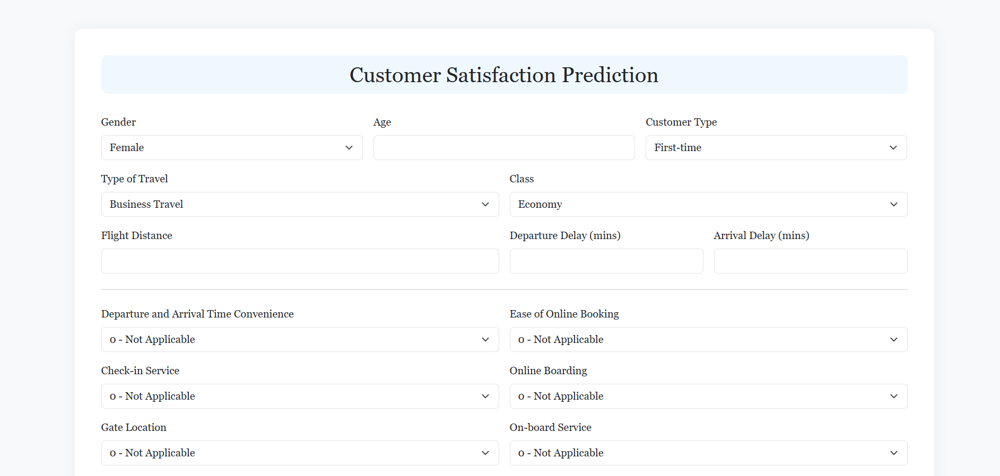

  <h1>Airline Customer Satisfaction Prediction</h1>
  
This is a machine learning web application built with <strong>Flask</strong> that predicts whether a customer is <strong>Satisfied</strong> or <strong>Neutral/Dissatisfied</strong> based on their in-flight experience and service-related features.

  <h2 style="color:#003366;">Project Overview</h2>
  
The goal is to build a classification model to predict customer satisfaction from airline service features such as check-in, boarding experience, cleanliness, food & drink, and more.

  <ul>
    <li>Exploratory Data Analysis (EDA)</li>
    <li>Model training using <strong>Logistic Regression</strong></li>
    <li>Web app deployment using <strong>Flask</strong></li>
    <li>Frontend UI with <strong>Bootstrap 5</strong></li>
  </ul>

  <h2 style="color:#003366;">Project Structure</h2>
  <pre style="background-color:#eee; padding:10px; border-radius:5px;">
Airline Customer Satisfaction Prediction/
│
├── app/
│   ├── templates/
│   │   └── index.html
│   └── app.py
├── data/
├── models/
│   ├── catbootmodel.pkl
│   ├── logreg_best.pkl
│   └── scaled.pkl
├── notebooks/
│   ├── 01_data_exploration.ipynb
│   └── 02_model_training_and_evaluation.ipynb
├── reports/
│   ├── Img
    │   └── form.png
│   └── presentation.pptx
│   └── project_summary.pdf
├── scripts/
├── requirements.txt
└── README.md
  </pre>

  <h2 style="color:#003366;">Input Features</h2>

  <h3>Basic Information</h3>
  <ul>
    <li>Gender</li>
    <li>Age</li>
    <li>Customer Type (Loyal / Disloyal)</li>
    <li>Type of Travel (Business / Personal)</li>
    <li>Class (Eco / Eco Plus / Business)</li>
  </ul>

  <h3>Flight Info</h3>
  <ul>
    <li>Flight Distance</li>
    <li>Departure Delay in Minutes</li>
    <li>Arrival Delay in Minutes</li>
  </ul>

  <h3>Ratings (Scale: 0 - N/A, 1 - Poor, 5 - Excellent)</h3>
  <ul>
    <li>Ease of Online Booking</li>
    <li>Check-in Service</li>
    <li>Online Boarding</li>
    <li>Gate Location</li>
    <li>On-board Service</li>
    <li>Seat Comfort</li>
    <li>Leg Room Service</li>
    <li>Cleanliness</li>
    <li>Food and Drink</li>
    <li>In-flight Service</li>
    <li>In-flight Wifi Service</li>
    <li>In-flight Entertainment</li>
    <li>Baggage Handling</li>
  </ul>

  <h2 style="color:#003366;">Model Details</h2>
  <ul>
    <li><strong>Model Used:</strong> Logistic Regression</li>
    <li><strong>Accuracy:</strong> ~87% on test data</li>
    <li><strong>Label:</strong> Customer Satisfaction (1 = Satisfied, 0 = Neutral/Dissatisfied)</li>
  </ul>

  <h2 style="color:#003366;">Tech Stack</h2>
  <table style="width:100%; border-collapse:collapse; margin:10px 0;">
    <thead>
      <tr style="background-color:#cce5ff;">
        <th style="padding:10px; border:1px solid #ccc;">Layer</th>
        <th style="padding:10px; border:1px solid #ccc;">Technology</th>
      </tr>
    </thead>
    <tbody>
      <tr>
        <td style="padding:10px; border:1px solid #ccc;">ML Modeling</td>
        <td style="padding:10px; border:1px solid #ccc;">Python</td>
      </tr>
      <tr>
        <td style="padding:10px; border:1px solid #ccc;">Backend</td>
        <td style="padding:10px; border:1px solid #ccc;">Flask</td>
      </tr>
      <tr>
        <td style="padding:10px; border:1px solid #ccc;">Frontend</td>
        <td style="padding:10px; border:1px solid #ccc;">HTML, CSS, Bootstrap 5</td>
      </tr>
      <tr>
        <td style="padding:10px; border:1px solid #ccc;">IDE</td>
        <td style="padding:10px; border:1px solid #ccc;">Jupyter, VS Code</td>
      </tr>
    </tbody>
  </table>

  <h2 style="color:#003366;">How to Run Locally</h2>
  <h4>1. Clone the Repository</h4>
  <pre style="background-color:#eee; padding:10px; border-radius:5px;"><code>git clone "https://github.com/namankamble/Projects/tree/main/Airline%20Customer%20Satisfaction%20Prediction" </code></pre>

  <h4>2. Install Requirements</h4>
  <pre style="background-color:#eee; padding:10px; border-radius:5px;"><code>pip install -r requirements.txt</code></pre>

  <h4>3. Run the Flask App</h4>
  <pre style="background-color:#eee; padding:10px; border-radius:5px;"><code>cd app
python app.py</code></pre>

  <h4>4. Open in Browser</h4>
  
Visit: <a href="http://127.0.0.1:5000" target="_blank">http://127.0.0.1:5000</a>

  <h2 style="color:#003366;">Deployment Suggestions</h2>
  <ul>
    <li><a href="https://render.com" target="_blank">Render</a></li>
    <li><a href="https://railway.app" target="_blank">Railway</a></li>
    <li><a href="https://heroku.com" target="_blank">Heroku</a></li>
    <li><a href="https://www.pythonanywhere.com" target="_blank">PythonAnywhere</a></li>
  </ul>

  <h2 style="color:#003366;">Sample Form UI</h2>
  

  <h2 style="color:#003366;">Contact</h2>
  

    <strong>Developed by:</strong> Naman 
    Email: <a href="mailto:namankamble1999@gmail.com">namankamble1999@gmail.com</a> 
    LinkedIn: <a href="https://www.linkedin.com/in/naman-kamble-b6005024b/" target="_blank">linkedin.com/in/naman-kamble-b6005024b</a>
  

  <h2 style="color:#003366;">License</h2>
  
This project is open-source and free to use under the <strong>MIT License</strong>.

